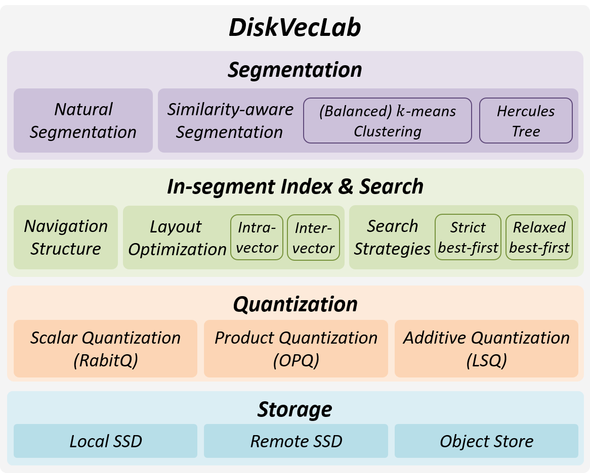

<div align="center">


# DiskVecLab: A Deployment-Realistic Evaluation Framework for Disk-Based Vector Search

</div>

DiskVecLab is a modular evaluation framework for disk-based vector search that decouples core components and enables controlled ablations and end-to-end comparisons across diverse storage environments, concurrency regimes, and query distributions.

<p align="center">
  
</p>

## Used Datasets

All datasets are publicly available and the links are provided as follows:
| Dataset | Dimensionality | Download Link | Note |
| --- | --- | --- | --- |
| LAION-T2I/I2I | 512/768 | [Official Site (512 dim.)](https://laion.ai/blog/laion-400-open-dataset/)/[Official Site (768 dim.)](https://laion.ai/blog/laion-5b/) | Both 512 and 768-dimensional versions provides text based vectors and image based vectors. In experiments we use 512 dimensional version for **text to image** search (out-of-distribution) and 768 dimensional version for **image to image** search (in-distribution). |
| DEEP | 96 | [Link from Yandex](https://research.yandex.com/blog/benchmarks-for-billion-scale-similarity-search/)/[Base Set](https://storage.yandexcloud.net/yandex-research/ann-datasets/DEEP/base.1B.fbin)/[Query Set](https://storage.yandexcloud.net/yandex-research/ann-datasets/DEEP/query.public.10K.fbin) | |
| Text2Image | 200 | [Link from Yandex](https://research.yandex.com/blog/benchmarks-for-billion-scale-similarity-search/)/[Base Set](https://storage.yandexcloud.net/yandex-research/ann-datasets/T2I/base.1B.fbin)/[Query Set](https://storage.yandexcloud.net/yandex-research/ann-datasets/T2I/query.public.100K.fbin) | A **text to image** search (out-of-distribution) dataset where base sets are image vectors and query sets are text vectors. |
| SIFT | 128 | [Official Site](http://corpus-texmex.irisa.fr/) | |
| SpaceV | 100 | [Official Repo](https://github.com/microsoft/SPTAG/tree/b2748d982c68be70240285b0e222acea62d6c08e/datasets) | |

## Evaluated Methods

We evaluated six state-of-the-art methods, including [DiskANN](https://github.com/microsoft/DiskANN), [Starling](https://github.com/zilliztech/starling), [MARGO](https://github.com/CodenameYZY/MARGO), [PipeANN](https://github.com/thustorage/PipeANN), [Gorgeous](https://github.com/yinpeiqi/Gorgeous), and [SPANN](https://github.com/microsoft/SPTAG).
For details of the methods, please refer to the corresponding papers below:
- [NeurIPS'19] DiskANN: Fast accurate billion-point nearest neighbor search on a single node
- [SIGMOD'24] Starling: An i/o-efficient disk-resident graph index framework for high-dimensional vector similarity search on data segment
- [VLDB'25] (MARGO) Select Edges Wisely: Monotonic Path Aware Graph Layout Optimization for Disk-Based ANN Search
- [OSDI'25] (PipeANN) Achieving Low-Latency Graph-Based Vector Search via Aligning Best-First Search Algorithm with SSD
- [arXiv preprint] Gorgeous: Revisiting the Data Layout for Disk-Resident High-Dimensional Vector Search
- [NeurIPS'21] SPANN: Highly-efficient billion-scale approximate nearest neighborhood search


## Usage

Our experiments were conducted on Ubuntu 24.04 with the following environment:
- Ubuntu 24.04
- GCC 13.3.0
- CMake 3.28.3
- Python 3.12
- Boost 1.83.0

### Example Usage

The segmentation, in-segment optimization, and quantization can be configured independently.
An example usage can refer to `./test/search_segments.py`.
- Before running the example, please make sure to set up the environment, and use CMake to build the source of algorithms with the corresponding configuration (e.g., `CMakeLists.txt`).
- The segmentation step is configured via different segmentaton method params classes, and are passed to the index building step.
- The in-segment optimization and quantization are configured via the index configuration file (e.g., `config_local.sh`), in which the corresponding parameters are set in the config file and passed to the index building step for all segments.
- The quantization codes are generated during the index building step, and are chosen during the search step based on the index configuration file, and can be overridden in the search step.
- For more details on the parameters, please refer to the arguments descriptions in source code.


```py
def run_natural_segmentation_example():
    NAME = "example_natural_segmentation"

    # Instaniate global configuration and dataset specification, then run the partition experiment
    P = NaturalParams(
        split_name=NAME,
        out_dir=f"{DATA_PATH}/data_split/{NAME}/", # Path to save the segments
        num_shards=40,                             # Number of segments to split into
        input_fmt="fvecs",                         # Input format of the dataset (e.g., fvecs)
    )

    B = BuildParams(
        generate_config_dataset=DS_NAME,
        config_local_path="config_local.sh",       # Path to the index configuration file (e.g., config_local.sh)
    )

    create_and_build_experiment(
        name=f"exp_{NAME}",
        global_cfg=G,
        dataset=DS,
        partition=P,
        build=B,
    )

    # Instaniate search parameters for segmented search, then run the search experiment
    S = SearchParams(
        build_type="release",
        mode="search_split",           # Search mode for segmented search
        algo="knn",                    # Search mode for segmented search
        shard_id=0,                    
        config_local_overrides={       # Search-time overrides for the index configuration file
            ...
        },
    )

    search_experiment(
        name=f"exp_{NAME}",
        global_cfg=G,
        dataset=DS,
        search=S,
    )
```
